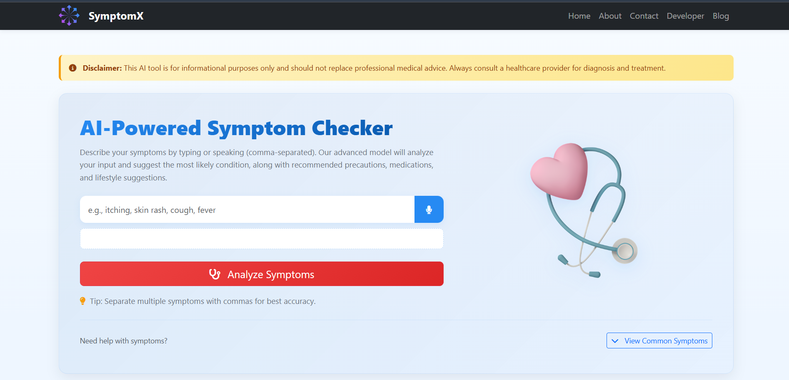
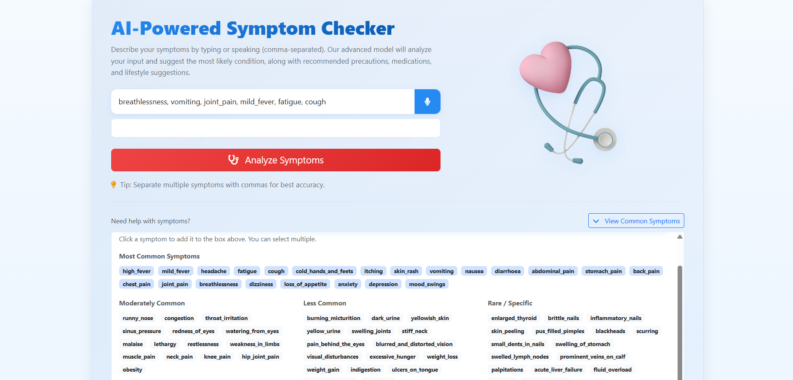

# 🩺 Medicine Recommendation System


An AI-powered system that predicts diseases and recommends suitable medicines, descriptions, precautions, workouts, and diets based on user symptoms. Built using **Python**, **Flask**, and **scikit-learn (v1.4.2)**, this project helps users make informed health decisions using machine learning models.

---

## 🔗 Live Demo

🌐 **[Try the Live Application Here](YOUR_DEPLOYED_LINK_HERE)**

> Replace `YOUR_DEPLOYED_LINK_HERE` with your actual deployment link (Heroku, Render, PythonAnywhere, etc.)

---

## 📸 Screenshots

### Home Page


### Symptom Input


### Prediction Results


### Disease Information


> **Note:** Create a `screenshots` folder in your repository and add your images there, or use direct image URLs.

---

## 🚀 Features
- Predicts disease based on entered symptoms  
- Recommends medicines, precautions, workouts, and diets  
- Supports multiple ML models (SVC, RandomForest, GradientBoosting, KNN, MultinomialNB)  
- Uses pre-trained `.pkl` models for fast predictions  
- Voice input support for symptom entry
- Simple and interactive interface  

---

## ⚙️ Tech Stack
- **Language:** Python  
- **Framework:** Flask  
- **Libraries:** scikit-learn==1.4.2, pandas, numpy, pickle  
- **Environment:** Jupyter Notebook / VS Code  

---

## 🧠 Models Used
| Model | File |
|--------|------|
| Support Vector Classifier | models/svc.pkl |
| Random Forest | models/random_forest.pkl |
| Gradient Boosting | models/gradient_boosting.pkl |
| K-Nearest Neighbors | models/knn.pkl |
| Multinomial Naive Bayes | models/multinomial_nb.pkl |

---

## 📋 Prerequisites

Before you begin, ensure you have the following installed:
- Python 3.8 or higher
- pip (Python package manager)
- Git

---

## 🧩 Setup Instructions

Follow these steps to run the project locally:

### 1️⃣ Clone the Repository

```bash
git clone https://github.com/nishantkr2003/Medicine-Recommendation-System.git
cd Medicine-Recommendation-System
```

### 2️⃣ Create and Activate a Virtual Environment

**Command Prompt (Windows):**
```bash
python -m venv venv
venv\Scripts\activate
```

**PowerShell (Windows):**
```bash
python -m venv venv
.\venv\Scripts\Activate.ps1
```

**Linux/Mac:**
```bash
python -m venv venv
source venv/bin/activate
```

### 3️⃣ Install Dependencies

Install all required Python packages using pip:
```bash
pip install scikit-learn==1.4.2 pandas numpy flask
```

### 4️⃣ Run the Application

Start the Flask server:
```bash
python main.py
```

### 5️⃣ Access the Application

Open your browser and navigate to:
```
http://127.0.0.1:5000/
```

---

## 📁 Project Structure

```
Medicine Recommendation System/
├── main.py                          # Flask application entry point
├── datasets/
│   ├── symptoms_df.csv             # Symptom descriptions
│   ├── precautions_df.csv          # Disease precautions
│   ├── medications.csv             # Medications database
│   ├── diets.csv                   # Diet recommendations
│   ├── workout_df.csv              # Workout suggestions
│   ├── description.csv             # Disease descriptions
│   └── Training.csv                # Training data (optional)
├── models/
│   ├── gradient_boosting.pkl       # Pre-trained gradient_boosting model
│   ├── knn.pkl                     # Pre-trained KNN model
│   ├── multinomial_nb.pkl          # Pre-trained multinomial_nb model
│   ├── random_forest.pkl           # Pre-trained random_forest model
│   └── svc.pkl                     # Pre-trained SVC model
├── static/
│   ├── style.css                   # Custom styles
│   ├── img.png                     # Logo
│   ├── p2.png                      # Developer image
│   └── Stethoscope.png             # Hero image
├── templates/
│   ├── index.html                  # Main page
│   ├── about.html                  # About page
│   ├── contact.html                # Contact page
│   ├── developer.html              # Developer page
│   ├── blog.html                   # Blog page
│   └── faq.html                    # FAQ page
├── screenshots/                    # Screenshots for README
│   ├── home.png
│   ├── symptom_input.png
│   ├── results.png
│   └── disease_info.png
├── venv/                           # Virtual environment
└── Medicine Recommendation System.ipynb     # Jupyter notebook file
```

---

## 📊 How It Works

### 1. User Input
- Type symptoms separated by commas (e.g., "fever, cough, headache")
- Or use voice input by clicking the microphone icon

### 2. Processing
- System converts symptoms to a vector format
- Passes through pre-trained SVC model
- Predicts most likely disease

### 3. Results Display
- Shows predicted disease
- Displays disease description
- Provides precautions
- Lists medications
- Suggests workouts
- Recommends diet

---

## 🔧 Troubleshooting

### Common Issues:

**Issue:** `ModuleNotFoundError: No module named 'sklearn'`  
**Solution:** Install scikit-learn using `pip install scikit-learn==1.4.2`

**Issue:** Models not loading  
**Solution:** Ensure all `.pkl` files are in the `models/` directory

**Issue:** Port already in use  
**Solution:** Change the port in `main.py` or kill the process using port 5000

**Issue:** Virtual environment not activating on PowerShell  
**Solution:** Run `Set-ExecutionPolicy -ExecutionPolicy RemoteSigned -Scope CurrentUser` then try again

---

## 🤝 Contributing

Contributions are welcome! Please feel free to submit a Pull Request.

1. Fork the project
2. Create your feature branch (`git checkout -b feature/AmazingFeature`)
3. Commit your changes (`git commit -m 'Add some AmazingFeature'`)
4. Push to the branch (`git push origin feature/AmazingFeature`)
5. Open a Pull Request

---

## ⚠️ Disclaimer

**This system is for educational purposes only and should not replace professional medical advice. Always consult with qualified healthcare professionals for medical concerns.**

---

## 👨‍💻 Author

**Nishant Kumar**  
📧 Email: nishantkr2003nna@gmail.com  
🎓 Student | Developer | AI Enthusiast  
🔗 GitHub: [@nishantkr2003](https://github.com/nishantkr2003)

---

## 🙏 Acknowledgments

- Thanks to the open-source community for datasets and inspiration
- scikit-learn documentation and contributors
- Flask framework developers

---

## 📝 License

This project is open-source and available under the MIT License.

**MIT License © 2025 Nishant Kumar**

---

### ⭐ If you find this project useful, please consider giving it a star on GitHub!

---

**Made with ❤️ by Nishant Kumar**
